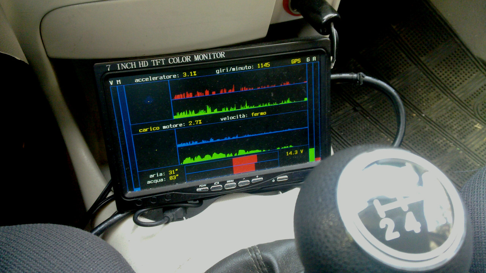

## Description

In-car monitoring/logging device with graphical output:

* throttle (0% to 100%)
* engine RPM (usually 750 to 4000)
* engine load (0% to 100%)
* speed (both wheels and GPS, in km/hour)
* short- and medium-term fuel economy predictions (as reported by OBD-II)
* inertial data (acceleration and gyro, 100 Hz sampling)

## Hardware

* Beagleboard XM running Arch Linux
* u-Blox USB GPS unit
* Sparkfun 9DOF IMU (inertial measurement unit)
* ELM327-compatible USB OBD-II (on-board diagnostics)
* Sunfounder 7" TFT HDMI display

## Software

Threads send events/data to the main loop channel, which does filtering, graphical screen updating, and shipping packets to a save'n'sync thread.

OBD-II error codes are shown (if reported) for a few seconds before starting the main loop.

Threads running:

* gps listener (also syncs date/time);
* inertial data logger;
* obd querying;
* buffered data save and sync.

Graphical library (virtual console and framebuffer) writes directly in mmap'ed display memory.

## QuickFAQ

*New releases?* This is a personal project tailored to my likes and my old car (which exposes an OBD-II interface but not CAN-bus); it's been running without modifications since early 2016 (this is why I don't use the most recent Rust language features). I do not plan to add new features until I'll switch to a new car.

*Binary file format?* Always 24 bytes packets. Check out the *Info* structure in the main source.

*What graphical library do you use?* None. Linux kernel initializes the screen framebuffer, I just had to mmap the usual */dev/vcsa1* and */dev/fb0* device files (a pixel is actually an *u32* 0RGB value).

*How do you transfer/visualize data files?* Using *rsync* via wifi and a (not released) Ruby program to build *gnuplot* scripts.

*OBD-II is slow.* Yes, especially if the car only supports ISO 14230-4 or SAE J1850 VPW, both running at about 10 kilobits/second: every single parameter query, except battery voltage, requires about 200-250 milliseconds; this is why I query a very few parameters (and some of them more often than others).
